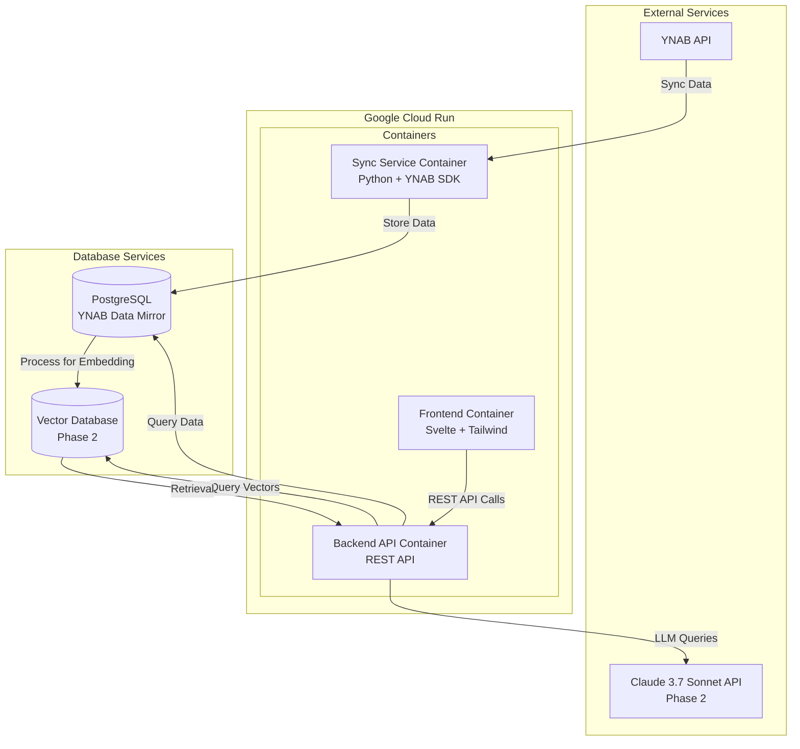
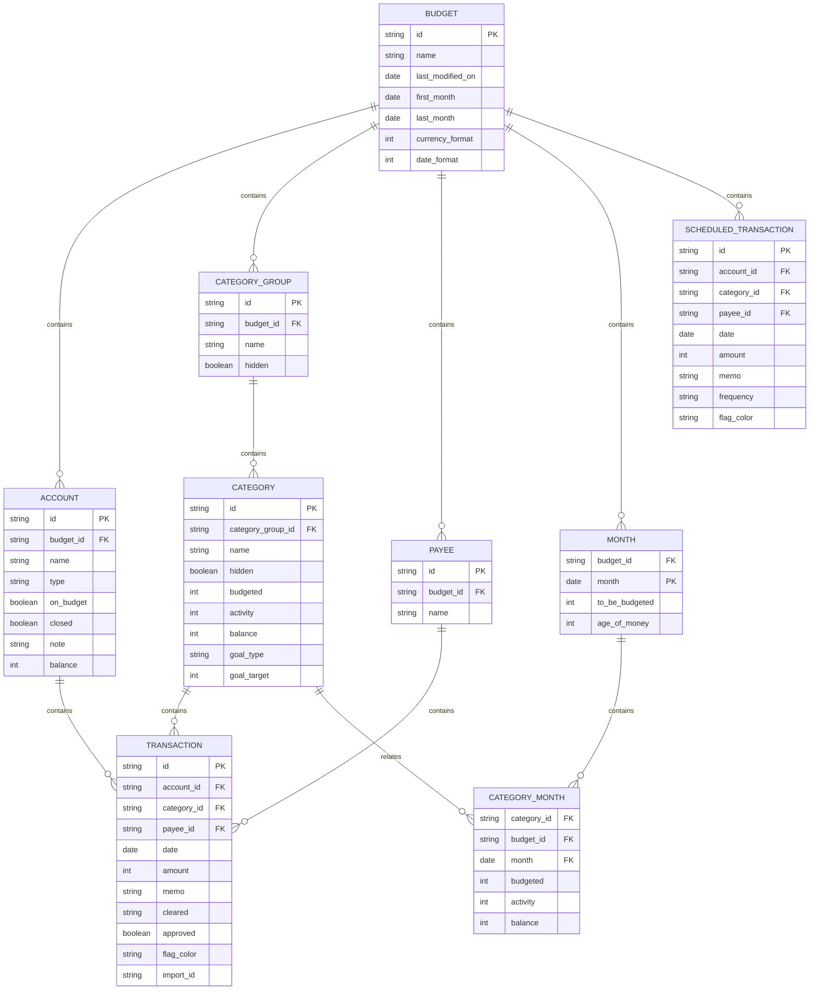

# Budgey

A comprehensive YNAB data sync and budget analysis platform with RAG capabilities.

## Project Overview

Budgey is a two-phase application that:

1. **Phase 1:** Syncs all data from the YNAB API using a personal access token and stores it in PostgreSQL with a schema mirroring YNAB's structure.
2. **Phase 2:** Implements RAG (Retrieval-Augmented Generation) with Claude 3.7 Sonnet for advanced budget analysis.

The application runs on Google Cloud Run using Docker containers, with a Svelte frontend and REST API backend.

## System Architecture



## Data Architecture



## Technical Stack

- **Backend**: 
  - Python 3.13 with YNAB SDK 1.2.0
  - FastAPI 0.110.x+ for REST endpoints
  - Drizzle ORM 0.30.x+
  - Poetry for dependency management

- **Database**:
  - PostgreSQL 16+ with pgvector extension

- **Frontend**:
  - Svelte 5
  - Tailwind CSS 4.x
  - Chart.js or D3.js for visualizations

- **Infrastructure**:
  - Docker Engine 26.x
  - Google Cloud Run
  - Google Cloud SQL (PostgreSQL)
  - GitHub Actions for CI/CD

- **AI**:
  - Claude 3.7 Sonnet (Phase 2)
  - Vector embeddings for RAG implementation

## Implementation Plan

### Phase 1: YNAB Data Sync and Storage

1. **Project Setup**
   - Initialize project structure
   - Set up Docker configuration
   - Configure PostgreSQL instance
   - Set up Drizzle ORM
   - Configure Poetry for dependency management

2. **Database Schema Design**
   - Create PostgreSQL schema mapping to YNAB's data model
   - Implement Drizzle models
   - Set up migration scripts

3. **YNAB API Integration**
   - Build Python sync service using YNAB SDK
   - Initial full sync of all data
   - Implement delta sync using server_knowledge parameter
   - Handle rate limits (200 requests/hour)
   - Schedule hourly updates

4. **Backend REST API Development**
   - Create endpoints for all entities
   - Implement Drizzle queries
   - Add filtering and sorting capabilities
   - Design caching strategies

5. **Frontend Development**
   - Set up Svelte 5 project with Tailwind CSS
   - Create responsive UI
   - Implement data visualizations
   - Build dashboards for financial insights

6. **Deployment**
   - Create Docker containers
   - Set up Google Cloud Run configuration
   - Configure environment variables
   - Implement monitoring

### Phase 2: RAG Implementation

1. **Vector Database Setup**
   - Configure pgvector extension
   - Create embedding pipeline

2. **Data Processing**
   - Transform financial data into embeddings
   - Create structured context for LLM consumption
   - Develop update strategy for vectors

3. **Claude 3.7 Sonnet Integration**
   - Set up API access and authentication
   - Build RAG pipeline
   - Implement prompt engineering

4. **Budget Analysis Features**
   - Spending pattern identification
   - Budget variance analysis
   - Goal tracking and recommendations
   - Customized financial insights

5. **Enhanced UI**
   - Natural language query interface
   - Financial insight visualizations
   - Budget assistance chatbot

## Data Sync Strategy

Given the YNAB API's 200 requests/hour limit:

1. **Initial Sync**: Bulk load all data entities
2. **Delta Sync**: Use server_knowledge parameter to get only changed data
3. **Prioritization**: Focus on frequently changing data in updates
4. **Batching**: Combine requests where possible

## RAG Implementation

For Claude 3.7 Sonnet integration:

1. **Context Selection**: Choose relevant financial data for each query
2. **Prompt Engineering**: Design templates for financial analysis
3. **Accuracy Verification**: Ensure valid calculations
4. **User Feedback Loop**: Improve retrieval based on interactions

## Setup

### Prerequisites

- Docker Engine 26.x
- Google Cloud account
- YNAB personal access token

### Environment Variables

- `YNAB_PERSONAL_ACCESS_TOKEN`: Your YNAB API token
- `DATABASE_URL`: PostgreSQL connection string
- `CLAUDE_API_KEY`: Claude API key (Phase 2)

### Development Environment

```bash
# Clone the repository
git clone https://github.com/your-username/budgey.git
cd budgey

# Set up environment variables
cp .env.example .env
# Edit .env with your credentials

# Start development containers
docker-compose up -d
```

### Python Services Setup

Both the sync and backend services use Poetry for dependency management:

```bash
# Install Poetry (if not already installed)
pip install poetry

# Install dependencies for sync service
cd sync
poetry install

# Install dependencies for backend service
cd ../backend
poetry install
```

## License

MIT